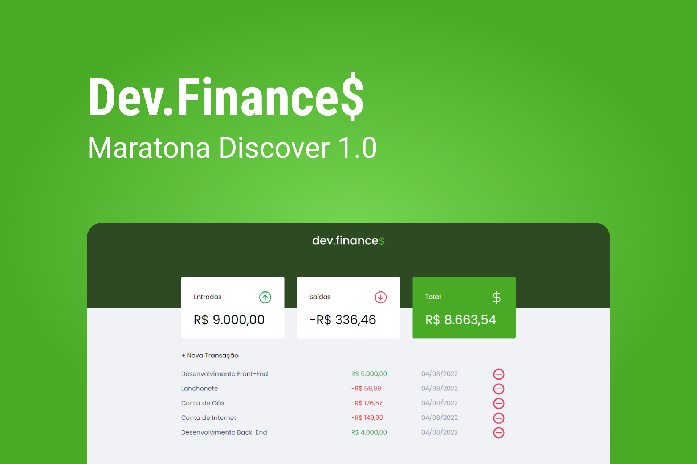

# Rockeatseat Maratora 01 Discover

  

## 🚀 Tecnologias

Esse projeto foi desenvolvido com as seguintes tecnologias:

- HTML
- CSS
- JavaScript

## 💻 Projeto

O dev.finances é uma aplicação de controle financeiro, onde é possível cadastrar e excluir transações e ver o saldo de entrada e saída 💰

## 📹Vídeo Demonstrativo

No meu LinkedIn tem um breve vídeo de como a plataforma funciona: https://www.linkedin.com/feed/update/urn:li:activity:6912909894052392960/
